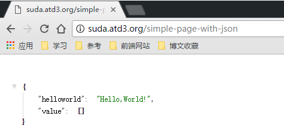
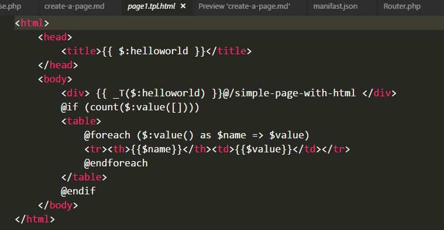

# 创建一个页面
创建一个页面，只需要一个命令即可。

## 创建一个HTML页面

运行命令：

```
> php .\app\console --router simple_page -c test\Page1@default -u /simple-page-with-html
created response:test\Page1@default
class file at :APP_DIR/modules/default/src/cn\atd3\response\test/Page1.php
template file at :APP_DIR/modules/default/resource/template/default/test/page1.tpl.html
```

访问页面：


## 创建一个返回JSON数据的页面

```
> php ./app/console --router simple_page_2 -c test\Page2@default -u /simple-page-with-json -j
created response:test\Page2@default
class file at :APP_DIR/modules/default/src/cn\atd3\response\test/Page2.php
```




##  具体说明查看

[命令参数说明](tools/router.md)

### 使用问题 FAQ

**Q** : 如何修改页面内容？     

**A** : 找到页面响应类修改内容即可，响应类生成路径按命名空间映射路径，基命名空间为App目录下的`app.namespace`设置的命名空间


文件内容为模板创建的：


本例子的第一个创建的HTML页面响应的路径为:`app/modules/default/src/cn/atd3/response/test/Page1.php`
解释：`app/modules/模块名/src/基命名空间/response/命名空间/类名.php`

**Q** : 如何修改页面模板？     

**A** : 找到页面模板修改内容即可，模板调用遵循 `模块:路径`，主题默认为`default`

本例的一个HTML页面的响应模板路径为:`app/modules/default/resource/template/default/test/page1.tpl.html` 
对应解释： `app/modules/模块名/resource/template/模板样式/命名空间全小写/类名全小写.tpl.html` 

初始内容




具体模板使用请查看[模板使用](tools/template.md)